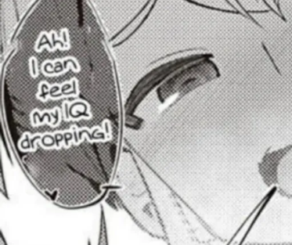
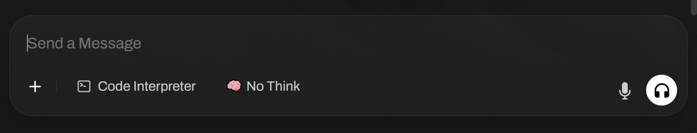
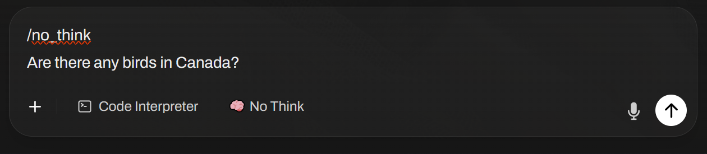
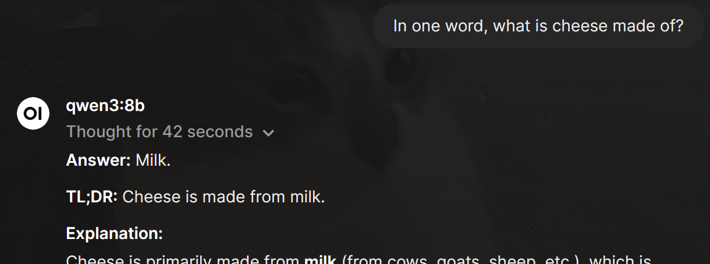
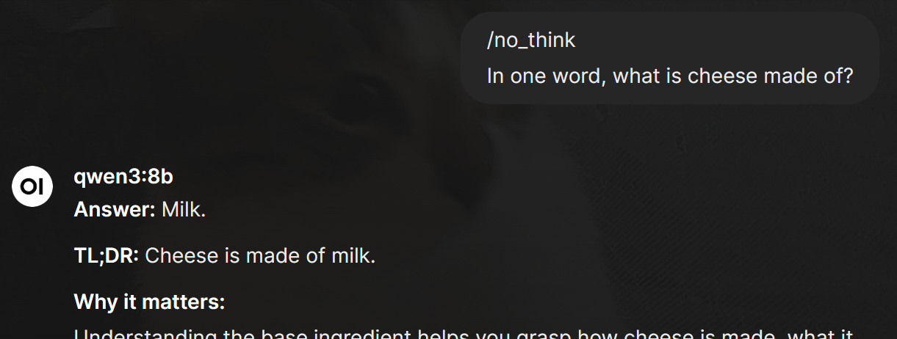

# Qwen3 No Think Injector

This is an improvised chrome extension that adds (🧠 No Think) Button for Open WebUI. Designed for Qwen3 models.

This Button when pressed will add `/no_think` message at the top of the input.

Qwen3 models thinks by default and are [instructed](https://github.com/QwenLM/Qwen3#:~:text=/think%20and%20/no_think%20instructions%3A%20Use%20those%20words%20in%20the%20system%20or%20user%20message%20to%20signify%20whether%20Qwen3%20should%20think.%20In%20multi%2Dturn%20conversations%2C%20the%20latest%20instruction%20is%20followed.) to bypass the thinking process when `/no_think` is present in the prompt. 

## Example

Before (approximate_total: 0h:1m:4s)

After (approximate_total: 0h:0m:17s)

## Future Work

I have plans to make this extention professional and available on the chrome store.